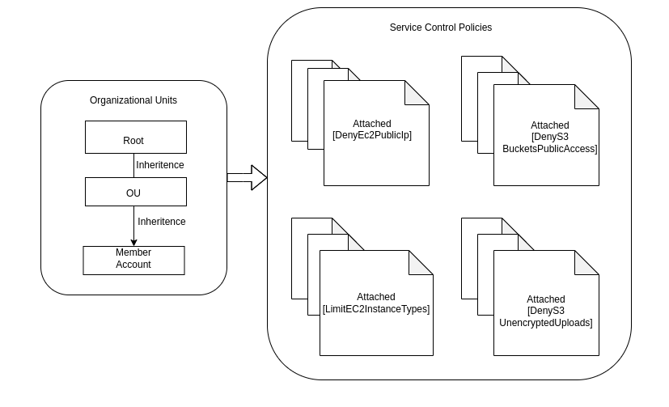

# Terraform Module for AWS SCPs

This repo contains AWS Service Control Policies (SCPs) for EC2 and S3 resources written in Hashicorp Terraform to be used in AWS Organizations(OU and/or Member Account).

## Purpose
Purpose for this module is to create SCPs that enable you to restrict, at the account level of granularity, what services and actions can be done.

Below is the overview of AWS SCP with some example policies:


## Deployment
To Deploy all of the AWS SCPs for respective resource navigate to [examples](./examples) folder and follow below steps:

```
# To get the plugins.
$ terraform init  

# To verify your resource planning
$ terraform plan -var-file=var.tfvars 

# To apply your SCPs
$ terraform apply -var-file=var.tfvars 
```

## Documentation
For more details about examples, read the README.MD file present in the respective directory "examples/*/README.MD".